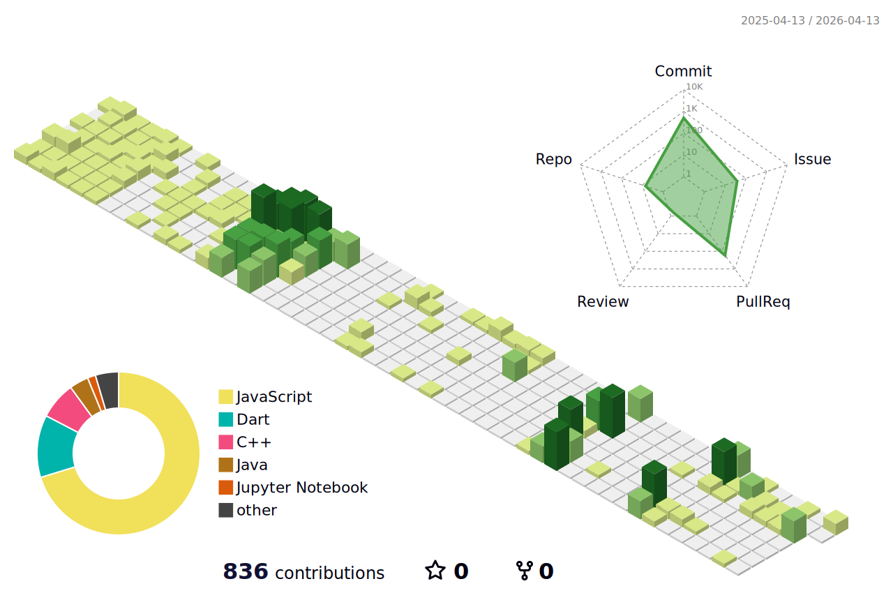

## Education

  
<b>🏫Enrolled in ITM (IT & Management) at SeoulTech, South Korea.(2022.03 -)</b>

    
🏫Pursuing a dual degree in ITMB at Northumbria University, UK.(2022.03 -)

  
  
⏸️ I’m currently on a leave of absence from university.(- 2026.02)

## Activities

 - 🐨 President of Coala, a Coding Education Volunteer Club (2023.03 - 2024.03)

 - Nowon district community donation through coding education for students at Jaehyun High School (2023.07 - 2023.08)

  

<!--
**yeomjungwoo/yeomjungwoo** is a ✨ _special_ ✨ repository because its `README.md` (this file) appears on your GitHub profile.

Here are some ideas to get you started:

- 🔭 I’m currently working on ...
- 🌱 I’m currently learning ...
- 👯 I’m looking to collaborate on ...
- 🤔 I’m looking for help with ...
- 💬 Ask me about ...
- 📫 How to reach me: ...
- 😄 Pronouns: ...
- ⚡ Fun fact: ...
-->

