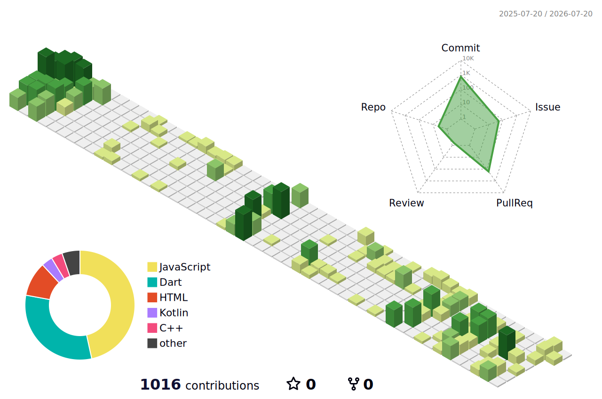

## Education

  
<b>🏫 Enrolled in ITM (IT & Management) at SeoulTech, South Korea.(2022.03 -)</b>

    
🏫 Pursuing a dual degree in ITMB at Northumbria University, UK.(2022.03 -)

  

## Activities

| Period | Organization / Program | Role & Description |
| :--- | :--- | :--- |
| 2025.08 - Present | **GDG on Campus SeoulTech (5th)** | Organizer |
| 2025.09 - 2025.11 | **KRX (Korea Exchange) [Happy Nuri] 15th** | Financial Education Volunteer |
| 2025.03 - 2025.08 | **KB Kookmin Bank [IT's Your Life] 6th** | Trainee |
| 2023.03 - 2024.02 | **ITM Major Dev Study & Volunteer Club 'Coala'** | President |
| 2023.07 - 2023.08 | **BK21 Community Talent Donation** | Python Instructor for High School Students |

<!--
**yeomjungwoo/yeomjungwoo** is a ✨ _special_ ✨ repository because its `README.md` (this file) appears on your GitHub profile.

Here are some ideas to get you started:

- 🔭 I’m currently working on ...
- 🌱 I’m currently learning ...
- 👯 I’m looking to collaborate on ...
- 🤔 I’m looking for help with ...
- 💬 Ask me about ...
- 📫 How to reach me: ...
- 😄 Pronouns: ...
- ⚡ Fun fact: ...
-->

